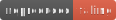

# Demo for automatic reproducibility checks

The above badge is automatically (re)generated with every push to the repository and indicates whether the R Markdown documents in this repository reproduce.
